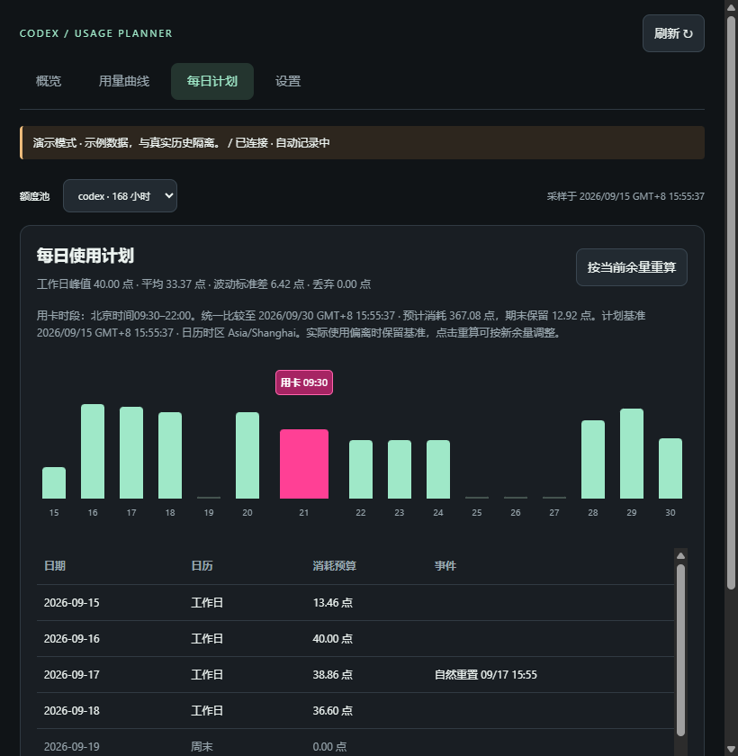

# Codex Usage Planner · 用量节奏

Windows 托盘中的 Codex 用量监视器：查看实际余量、与计划的偏差、历史曲线，以及考虑重置卡和节假日的每日预算。

## 功能

- **内嵌托盘面板**：Windows Forms + WebView2，无需另外打开浏览器。
- **双环图标**：外环显示实际剩余；内环以半圈为计划基准，超过半圈、玫红表示消耗偏快，不足半圈、青色表示偏慢。按每日预算调整灵敏度，相差半天预算对应满圈或空圈。
- **状态故障可见**：读取失败或数据过期时显示灰环和叹号，悬停查看原因。
- **联合用量计划**：当前余量、自然重置、重置卡到期时间一起参与工作日消耗速度的平滑优化。
- **节假日日历**：默认中国大陆2026年法定假期和调休；休息日零消耗，支持自定义休假与每日强度。
- **用卡时段**：北京时间09:30–22:00，计划图直接标注用卡时间。不会自动兑换重置卡。
- **用量曲线**：实际余量、固定计划基准及短期趋势，支持历史导出；休息日不虚构消耗。
- **时区处理**：显示时区与工作日日历时区独立，按实际时间处理部分工作日及夏令时。

## Windows 启动

需要 Node.js 20+、Windows .NET Framework 4.6.2+、Microsoft Edge WebView2 Runtime，以及本机已登录的 Codex ChatGPT 账户。实际开发验证使用 Node.js 24。

1. 下载仓库 ZIP 并解压到可写目录，或克隆仓库。
2. 双击 **Start-Windows.cmd**。
3. 首次启动会从 NuGet 下载固定版本的 WebView2 SDK，校验 SHA-256，再编译原生托盘外壳。需要联网；后续直接启动已编译程序。

点击托盘图标打开面板；点击外部收起，顶部“固定”保持显示，右键“退出”停止本程序服务。

也可手动构建：

~~~powershell
powershell -NoProfile -ExecutionPolicy Bypass -File .\Build-Windows.ps1
powershell -NoProfile -ExecutionPolicy Bypass -File .\Start-Windows.ps1
~~~

Node.js 若不在默认安装目录，可设置 PLANNER_NODE 为 node.exe 的完整路径。RPC 回退程序可通过 CODEX_COMMAND 指定，例如 JSON 数组中的 Codex 可执行文件路径。

## 开发与测试

无 npm 第三方运行依赖。

~~~sh
npm test
npm run demo
npm start
~~~

演示页面为 http://127.0.0.1:43128；真实状态页面为 http://127.0.0.1:43127。不要同时运行占用同一端口的托盘和调试服务。

原生自检：

~~~powershell
powershell -NoProfile -ExecutionPolicy Bypass -File .\Start-Windows.ps1 -Demo -Smoke
~~~

测试覆盖日历、时区、重置卡时段、额度守恒、规划基准、读取重试、HTTP保护、持久化及恢复调度。原生自检包含内环快慢方向、零预算边界和RPC异常灰态。

## 计划如何计算

每个有有效工作时间的完整额度周期尽量分配完现有额度；所有候选路径使用相同的比较终点，最后未结束周期的余额单列保留。先减少实际丢弃，再比较有效工作时间加权的速度方差。允许提前用卡改变后续自然重置时刻，当前周期也参与优化。

用卡后的重置边界按“兑换时间 + 服务端窗口时长”模拟，实际使用后以服务端新边界重算。搜索采用小时网格和5分钟局部细化，不保证连续时间全局最优。最多规划90天内最早8张卡。未核验年份明确提示，不把周末日历冒充官方节假日安排。

默认工作日在整个自然日内分配预算，当前日只计剩余部分；未建模办公时段。09:30–22:00仅限制兑换操作时间。计划保留固定基准，不随每次实际用量更新而归零差额，可主动点击“按当前余量重算”。

## 本机数据与读取

优先只读使用本机 Codex OAuth 登录态访问用量接口，失败回退 Codex app-server。私有 wham 接口可能随服务端变化而需要适配。程序不自行刷新共享登录令牌、不记录凭证、不自动使用重置卡。

所有历史、设置及诊断在 **data/** 中，不包含于仓库。HTTP服务仅监听127.0.0.1，并验证Host、Origin与随机页面令牌。对网络超时、连接失败和5xx做一次短间隔重试；普通网络故障后每60秒检查，认证拒绝或限流采用5分钟间隔。手动刷新会替换旧等待。诊断记录分层错误和脱敏摘要，文件轮转，不记录HTTP响应正文。

## 参考与第三方组件

- [CodexBar（macOS）状态读取](https://github.com/steipete/CodexBar/blob/main/docs/codex.md)
- [codex-usage（Windows）](https://github.com/Tooblippe/codex-usage)
- [Codex App Server 文档](https://learn.chatgpt.com/docs/app-server)
- [重置卡规则](https://help.openai.com/en/articles/20001498-how-banked-codex-resets-work)
- [2026年节假日通知](https://www.beijing.gov.cn/cs/gncs/zcwj/202603/t20260327_4568275.html)

WebView2 SDK许可证与第三方声明见 native/LICENSE.txt、native/NOTICE.txt。SDK版本与校验值见 native/dependency.json。本项目为独立工具，与OpenAI无隶属关系。
