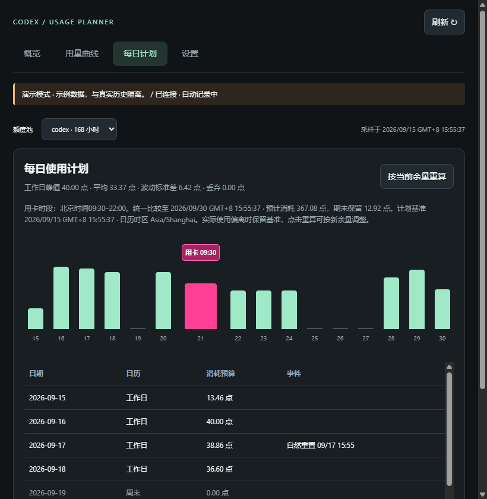

# Codex Usage Planner · 用量节奏

Windows 托盘 / macOS 菜单栏中的 Codex 用量监视器：查看实际余量、按需用卡建议、每日容量预算，以及最近会话的有效响应 TPS。



## 它解决哪些日常痛点？

Codex 只显示“还剩多少”时，很难直接判断今天能用多少、当前消耗是否太快，以及什么时候用重置卡更合适。这个工具把余量、工作日和重置机会放在一起，帮助安排接下来几天的使用节奏。

| 日常遇到的问题 | 当前实现如何帮助 |
| --- | --- |
| 写代码时要反复打开状态页面，打断工作 | 托盘常驻显示余量，点击图标直接展开内嵌面板；不用切换到外部浏览器。 |
| 剩余55%到底够不够？单看百分比没有时间参照 | 将实际余量与固定计划比较。内环半圈表示按计划消耗，超过半圈变玫红提示用得偏快，不足半圈为青色表示还有余裕。 |
| 差额只有一两个百分点，小图标上看不出来 | 内环按“相差多少个工作日的预算”调整灵敏度，而非固定百分比刻度；悬停仍可查看精确差额。 |
| 简单均分额度，容易前几天宽松、后几天突然紧张 | 当前余量与后续周期联合规划，比较同一时间范围内的工作日消耗速度，尽量减少阶段之间的跳变。 |
| 等自然重置、用重置卡之间不好取舍，临到期才发现安排不合理 | 根据可信余量、近期消耗、自然重置和卡片到期给出继续使用、稍后复核或不用卡的选择。详细计划中的时刻仅是容量参考。 |
| 把卡片到期日误当成新额度必须用完的日期 | 仅要求卡片在到期前兑换，不强制提前一周，也不要求新额度在原卡片到期前耗尽。 |
| 周末和长假不用Codex，按自然日平摊会算错预算 | 默认休息日零消耗，纳入中国大陆2026年节假日和调休；也支持自己的休假或半天使用计划。 |
| 计划提醒落在凌晨，或不同时区导致看错日期 | 可按工作日时区配置分段工作时段，兑换窗口预留15分钟操作余量；显示时区独立，时间计算覆盖夏令时变化。未配置时段时，容量计划沿用北京时间09:30–22:00。 |
| 感觉额度消耗异常，但没有历史依据 | 保存实际采样与当时的计划基准，绘制历史曲线并支持导出；不会用今天的新计划覆盖过去的目标。 |
| 请求超时后图标还像正常状态，或者网络恢复后一直显示旧错误 | 过期或失败时显示灰环和叹号；普通网络失败后每分钟复查，页面显示下次检查时间，保留分层脱敏诊断。 |
| 最近使用的任务速度没有出现在首页 | 首页常显最近会话 TPS；macOS 菜单栏独立更新。配置可达的 SSH 主机后，远端会话也参与选择，断线读数明确标记。 |

例如，某个工作日计划应剩50%，实际只剩45%，且计划每天消耗20个百分点：表示比计划多消耗了四分之一个工作日的预算，内环显示约四分之三圈并变为玫红色。实际剩55%则显示约四分之一圈、青色。外环始终显示真实剩余。

**适合谁：**经常使用Codex、希望把周额度用得更均匀、持有重置卡，或工作日与休息日使用强度差异较大的用户。

**能力边界：**它提供使用预算与提醒，不会增加账户额度、自动兑换卡片或保证未来用量。计划不考虑任务难度和模型成本差异；未来重置边界是模拟值，以服务端实际返回为准。网络恢复机制可以避免旧错误长期残留，但不能消除外部网络或服务端中断。

## 功能

- **内嵌托盘面板**：Windows Forms + WebView2，无需另外打开浏览器。
- **双环图标**：外环显示实际剩余；内环以半圈为计划基准，超过半圈、玫红表示消耗偏快，不足半圈、青色表示偏慢。按每日预算调整灵敏度，相差半天预算对应满圈或空圈。
- **状态故障可见**：读取失败或数据过期时显示灰环和叹号，悬停查看原因。
- **联合用量计划**：当前余量、自然重置、重置卡到期时间一起参与工作日消耗速度的平滑优化。
- **按需用卡建议**：信息不完整时等待核验；自然重置临近时优先复核实际需求，允许选择不用卡。容量计划与实时建议分别展示。
- **节假日日历**：默认中国大陆2026年法定假期和调休；休息日零消耗，支持自定义休假与每日强度。
- **用卡时段**：支持可配置的工作时段与15分钟操作余量；未配置时段时，容量计划沿用北京时间09:30–22:00。计划图标注容量参考时刻，不会自动兑换重置卡。
- **最近会话 TPS**：按最近活动自动选择，详情显示同模型与推理强度的有效样本；支持本机及已配置的 SSH 来源。
- **可选系统提醒**：默认关闭；支持稍后提醒、忽略当次和持久化去重。
- **用量曲线**：实际余量、固定计划基准及短期趋势，支持历史导出；休息日不虚构消耗。
- **时区处理**：显示时区与工作日日历时区独立，按实际时间处理部分工作日及夏令时。

## macOS 启动

需要 macOS 13+、Xcode Command Line Tools（`xcode-select --install`）、Node.js 20+，以及本机已登录的 Codex ChatGPT 账户。当前实机验证环境为 Apple Silicon / macOS 27；其他版本尚未实机验证。

双击 **Start-macOS.command**，首次会编译 Swift + AppKit + WKWebView 原生外壳。构建会将本机 Node 运行时复制进应用，之后打开应用无需终端 PATH 中有 Node。构建脚本支持 `PLANNER_NODE`，并识别 Homebrew 和 Codex 的本地运行时。

```sh
./Build-macOS.command
./Start-macOS.command
# 示例数据与真实数据隔离
./Start-macOS.command --demo
```

成品位于 `dist/Codex Usage Planner.app`，可以移动到“应用程序”目录。它是本机架构的临时签名构建，未公证；不是可直接分发到其他 Mac 的安装包。修改源码后需退出应用并重新构建。

- 菜单栏：双环 + 周剩余百分比 + 最近会话 TPS，例如 `周 45% · 23.5 TPS`。配置 SSH 主机后，本机与全部已连接主机参与最近活动选择，远端读数标记 `·SSH`；悬停显示主机名称。TPS 每秒更新，关闭面板也会更新；空闲标记“闲”，超过5分钟的样本标记“旧”，读数缺失或来源断线显示 `— TPS`。TPS 是最近响应的有效吞吐，不是逐 token 解码速度。
- 左键打开 / 收起面板；右键提供刷新、固定面板、数据目录和退出。
- 沿用概览、历史曲线、每日计划、设置和历史 JSON 导出，其他额度池在面板内选择。
- 原生端每 5 秒检查本机服务摘要，不依赖面板显示状态；服务按原有节奏读取远端。失败、过期和睡眠恢复期间显示灰环与叹号。唤醒后强制读取远端，悬停显示最后成功更新时间。服务退出后最多自动重启3次（2/4/8秒，并重新选择端口）；连续稳定运行5分钟后重置重试额度，或通过右键“重新连接服务”手动重试。
- 同一数据模式只允许一个实例；退出时结束自己启动的服务。默认不设置登录启动，系统通知默认关闭；可在设置中启用需要行动时的提醒。
- 数据保存在 `~/Library/Application Support/Codex Usage Planner/live/`，演示在 `demo/`，不写入应用包。移除应用即可停止使用，历史数据保留。
- 原生服务使用随机回环端口与每次启动的新令牌；WKWebView 只允许本机页面和历史导出，不读取浏览器 Cookie。

原生状态测试与 WKWebView 演示自检：

```sh
mkdir -p .build
xcrun swiftc macos/UsageState.swift macos/StateTests.swift -o .build/state-tests
.build/state-tests
open -n "dist/Codex Usage Planner.app" --env PLANNER_SMOKE_DIR="$PWD/.build" --args --demo --smoke
# .build/macos-smoke.json 与 .build/macos-smoke.png 是实际内嵌页面的结果
# 追加 --recovery-smoke 可主动结束演示服务，验证自动重启及调用唤醒刷新流程
```

自检前退出已运行的演示实例；`open` 异步启动，自检完成后应用自动退出，再查看结果文件。

## Windows 启动

需要 Node.js 20+、Windows .NET Framework 4.6.2+、Microsoft Edge WebView2 Runtime，以及本机已登录的 Codex ChatGPT 账户。实际开发验证使用 Node.js 24。

1. 下载仓库 ZIP 并解压到可写目录，或克隆仓库。
2. 双击 **Start-Windows.cmd**。
3. 首次启动会从 NuGet 下载固定版本的 WebView2 SDK，校验 SHA-256，再编译原生托盘外壳。需要联网；后续直接启动已编译程序。

点击托盘图标打开面板；点击外部收起，顶部“固定”保持显示，右键“退出”停止本程序服务。

也可手动构建：

~~~powershell
powershell -NoProfile -ExecutionPolicy Bypass -File .\Build-Windows.ps1
powershell -NoProfile -ExecutionPolicy Bypass -File .\Start-Windows.ps1
~~~

Node.js 若不在默认安装目录，可设置 PLANNER_NODE 为 node.exe 的完整路径。RPC 回退程序可通过 CODEX_COMMAND 指定，例如 JSON 数组中的 Codex 可执行文件路径。

## SSH 会话速度

在“设置 → SSH 会话速度”添加主机名称、SSH 别名或 `user@host`，最多8台。端口留空沿用系统 SSH 配置（无配置时22）；可填写端口及远端 Codex 目录。目录留空使用远端进程的 `CODEX_HOME`，未设置时使用 `~/.codex`；如果 Codex 运行在另一用户或自定义目录，需填实际目录。

Windows 与 macOS 客户端共用 Node 采集和测量逻辑，使用系统 OpenSSH 客户端；远端目前支持有 Python 3 的 Linux / macOS。沿用已配置的 SSH 密钥、ssh-agent 与已核验主机密钥，不保存密码或私钥。首次使用请先在终端成功执行 `ssh 主机`，非22端口使用 `ssh -p 端口 user@host`。软件采用非交互登录和严格主机密钥验证，失败会显示原因并退避重连。

采集脚本通过 SSH stdin 临时运行，不安装远端文件；只回传响应时间、token 计数和会话/模型标识，不回传对话正文、工具参数或认证文件。每台主机按最近文件活动读取最多24份日志的有限尾部，已覆盖文件每秒更新，新会话和旧会话续聊约5秒内发现。主机时钟差仅用于时间展示及跨主机排序，TPS 始终用同一主机的响应时长计算。

主机与会话分别统计，不合并父会话、子代理或同 ID 的不同主机。详情可选择固定会话；概览与菜单栏自动显示最近使用的已连接会话，远端断线时可回退到其他已连接来源，详情中的旧读数明确标记。

**连接边界：**Codex Desktop 的远程控制连接 ID 不能直接作为 SSH 地址，软件目前不能复用其加密通道。SSH 不可达且没有其他日志回传通道时，不能实时统计远端 TPS；本机对话缓存、账户总额度和整轮耗时不足以可靠还原远端响应速度。此时不推测远端 TPS。

## 开发与测试

无 npm 第三方运行依赖。

~~~sh
npm test
npm run demo
npm start
~~~

演示页面为 http://127.0.0.1:43128；真实状态页面为 http://127.0.0.1:43127。不要同时运行占用同一端口的托盘和调试服务。

原生自检：

~~~powershell
powershell -NoProfile -ExecutionPolicy Bypass -File .\Start-Windows.ps1 -Demo -Smoke
~~~

测试覆盖日历、时区、重置卡时段、额度守恒、规划基准、读取重试、HTTP保护、持久化及恢复调度。原生自检包含内环快慢方向、零预算边界和RPC异常灰态。

## 计划如何计算

每个有有效工作时间的完整额度周期尽量分配完现有额度；所有候选路径使用相同的比较终点，最后未结束周期的余额单列保留。先减少实际丢弃，再比较有效工作时间加权的速度方差。允许提前用卡改变后续自然重置时刻，当前周期也参与优化。

用卡后的重置边界按“兑换时间 + 服务端窗口时长”模拟，实际使用后以服务端新边界重算。搜索采用小时网格和5分钟局部细化，不保证连续时间全局最优。最多规划90天内最早8张卡。未核验年份明确提示，不把周末日历冒充官方节假日安排。

工作时段可在设置页按工作日日历时区分段填写，例如 `09:00-11:45`、`14:00-17:30`、`19:00-22:00`（每行一段）。预算仅在这些时段内分配，午休和下班后保持不变；实际用量仍全天记录。留空保留全天预算，既有用户不自动更改时段。当前日仅计剩余工作时段。已配置时段时，容量计划的用卡候选限于这些时段并预留15分钟操作余量；未配置时段时，沿用北京时间09:30–22:00。计划保留固定基准，不随每次实际用量更新而归零差额，可主动点击“按当前余量重算”。

## 本机数据与读取

优先只读使用本机 Codex OAuth 登录态访问用量接口，失败回退 Codex app-server。私有 wham 接口可能随服务端变化而需要适配。程序不自行刷新共享登录令牌、不记录凭证、不自动使用重置卡。

所有历史、设置及诊断在 **data/** 中，不包含于仓库。HTTP服务仅监听127.0.0.1，并验证Host、Origin与随机页面令牌。对网络超时、连接失败和5xx做一次短间隔重试；普通网络故障后每60秒检查，认证拒绝或限流采用5分钟间隔。手动刷新会替换旧等待。诊断记录分层错误和脱敏摘要，文件轮转，不记录HTTP响应正文。

## 参考与第三方组件

- [CodexBar（macOS）状态读取](https://github.com/steipete/CodexBar/blob/main/docs/codex.md)
- [codex-usage（Windows）](https://github.com/Tooblippe/codex-usage)
- [Codex App Server 文档](https://learn.chatgpt.com/docs/app-server)
- [重置卡规则](https://help.openai.com/en/articles/20001498-how-banked-codex-resets-work)
- [2026年节假日通知](https://www.beijing.gov.cn/cs/gncs/zcwj/202603/t20260327_4568275.html)

WebView2 SDK许可证与第三方声明见 native/LICENSE.txt、native/NOTICE.txt。SDK版本与校验值见 native/dependency.json。本项目为独立工具，与OpenAI无隶属关系。

## 跨平台可信状态保护

Windows 和 macOS 都通过 `server.mjs` 使用同一份 `snapshot-guard.mjs`，OAuth 和 RPC 返回值统一规范化后再核验，不依赖原生外壳。

- 重置卡明细未知或不完整时，只保留当前账户以前确认且未到期的卡片，并展示待核验提示；不把请求失败解释成卡片清空。确认空清单或服务端明确返回数量为零时清空缓存，明确已兑换的卡片立即移除。无到期时间的卡片保留，但不强制安排。
- 同一额度池、同一窗口长度内，重置边界移动超过60秒，或余量回升超过2个百分点，会暂缓采纳。正常到期后推进到合理未来边界的自然重置直接通过。
- 可疑变化需要两次间隔至少30秒、最多5分钟的一致采样：重置边界相差不超过60秒，后一次余量不比第一次高超过1个百分点。期间保留上次可信额度与计划，标记待核验，不把可疑数据写入用量历史；手动重算也不能绕过核验。
- `snapshot-guard.json` 持久化可信快照和待核验候选，重启继续核验；切换账户不继承另一账户的卡片或候选。核验是跨采样一致性检查，并非服务端真实性证明；持续一致的错误读数仍可能通过，手动兑换后的提前重置也可能延迟一个采样周期展示。


## 实时用卡建议与速度详情

首页按“先保障实际工作，再减少有需求的浪费”给出继续使用、稍后复核或不用卡的建议。卡片或额度未知、读数过期、异常重置待核验时不肯定建议兑换；自然重置临近时优先等待。近期趋势至少需要连续30分钟有效样本，仍不代表未来任务需求。

配置的工作时段同时约束兑换窗口，并预留15分钟操作余量。详细计划仍是容量分配参考：它假设按分配速度使用额度，不预测任务需求，不能保证零浪费或作为兑换指令。兑换需要用户在 Codex 手动完成，之后仍经过共享的服务端状态核验。

可在设置启用系统提醒（默认关闭）。Windows 托盘和 macOS 通知使用同一服务端建议与提醒标识；支持稍后30分钟、忽略本次提醒、持久化去重。系统权限和勿扰模式仍可能影响展示。

首页常显最近使用会话的 TPS，详细统计可折叠。速度测量参考 [adenta/codex-tps](https://github.com/adenta/codex-tps)，许可见 `licenses/codex-tps-MIT.txt`。显示的是**有效响应吞吐**：输出 token / 推断响应耗时，包含首 token 等待，剔除可以分离的工具执行，并非纯解码速度。输出已包含推理 token；缺失推理计数显示未知，矛盾计数或模糊时间边界不计入。最近7个同模型、同推理强度样本显示中位数，另列总输出/总时长。

本机来源只读 CODEX_HOME（默认 ~/.codex）按文件最近活动选出的最多24个会话日志，包含旧会话续聊。通过文件监听发现新活动，每秒增量读取，网页独立每秒检查；文件监听不可用时，每60秒重新发现目录。初次只读大文件末尾2 MiB，目录条目上限20000，不保存对话正文。配置 SSH 主机后，其他已连接来源也参与最近活动选择，读取范围见“SSH 会话速度”。详情可手动选择会话或子代理。

生成中保留最近有效响应值并标注样本年龄，日志写入响应计数后更新；这不是逐 token 实时解码速度。它不跟随 Codex 当前选中任务，也不覆盖未配置的远端、归档或全账户。速度不参与订阅额度和重置卡计算。旧样本、空闲、工具执行中和生成中分别标记。
